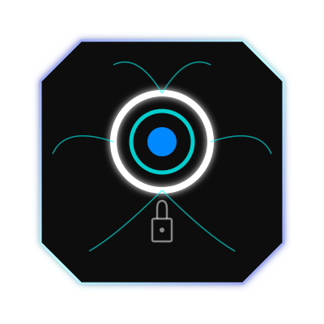
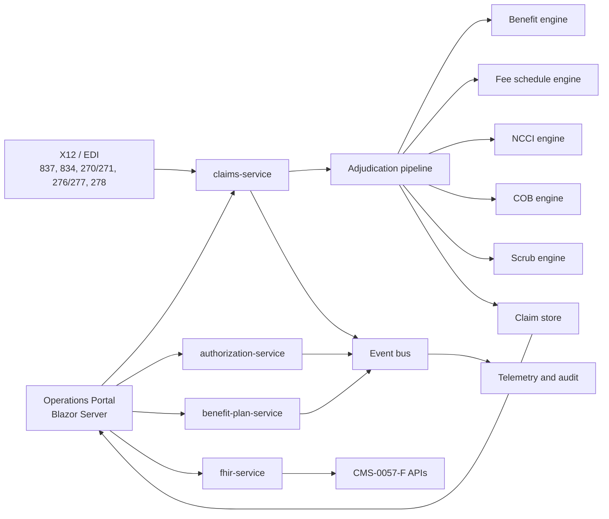

# CloudHealthOffice



[](LICENSE)
[](https://dotnet.microsoft.com/)
[](docs/deployment/DEPLOYMENT.md)
[](docs/features/FHIR-INTEGRATION.md)
[](docs/compliance/CMS-0057-F-READINESS-MATRIX.md)

Source-available payer admin platform. Claims, benefits, eligibility, prior
auth, FHIR, and X12 — meant to run on Kubernetes next to (or instead of) a
legacy CAPS stack.

Licensed under BSL 1.1. You can use it for eval, development, test, and
staging. Production use has extra terms; see [LICENSE](LICENSE).

## What this is

Most health plans still run Facets, QNXT, or HealthEdge as the place all
business logic lives. Those systems work. They were not built around FHIR R4,
CMS-0057-F APIs, or a claims pipeline you can actually inspect.

CloudHealthOffice is the other shape: APIs and engines first, portal on top,
adjudication you can score instead of trusting a black box. You can stand it
up locally, run a workload against it, and grow from there.

It is a real repo, not a packaged appliance. Some services are further along
than others. The Million Claim Challenge numbers are local Kubernetes runs,
not a cloud capacity promise.

## Who usually cares

- Plan engineering teams looking at a CAPS modernization path
- Architects who own claims, benefits, eligibility, or prior auth
- Interop folks implementing CMS-0057-F, FHIR R4, and X12
- Contributors who want to work on the platform itself

## What is in here

| Area | What you will find |
| --- | --- |
| Claims | Professional / institutional / dental synthetic claims, workflow scoring, mass adjudication console |
| Benefits | Declarative plans, cost share, accumulators, service-category mapping, plan versions |
| Pricing and edits | Fee schedules, NCCI/MUE, scrubbing, COB, network checks, prior-auth rules |
| Interop | FHIR R4 projections, X12 parse/process, terminology, CMS-0057-F docs |
| Portal | Claims search and detail, mass adj, EDI history (834/837), queues, admin |
| Deploy | Docker Compose, Kubernetes manifests, GitHub Actions |
| Benchmarks | 5K through 1,000,000-claim evidence packets |



Architecture notes live in [docs/architecture/README.md](docs/architecture/README.md).

## Screenshots

These are from local Docker Desktop Kubernetes runs, via the mass adjudication
console.

| View | Screenshot |
| --- | --- |
| 100K run dashboard | [episode-008-100k-dashboard.png](docs/million-claim-challenge/podcast/episode-008/screenshots/episode-008-100k-dashboard.png) |
| Outcome breakdown | [episode-008-100k-outcome-breakdown.png](docs/million-claim-challenge/podcast/episode-008/screenshots/episode-008-100k-outcome-breakdown.png) |
| Claim detail | [episode-008-claim-detail-summary.png](docs/million-claim-challenge/podcast/episode-008/screenshots/episode-008-claim-detail-summary.png) |
| Live telemetry | [episode-007-live-telemetry-running.png](docs/million-claim-challenge/podcast/episode-007/screenshots/episode-007-live-telemetry-running.png) |

## Million Claim Challenge

This is how we check whether adjudication is actually right, not just fast.
Paid, denied, pended, mismatched, unsupported, and platform failures are
counted separately. Payment amount is gated on its own.

Published local runs include:

- Full 1,000,000-claim corpus (episode 15): zero platform failures,
  129,981/130,000 workflow checks matched, no unsupported scenarios,
  20,000/20,000 payments exact within a cent.
- 100,000-claim local Kubernetes run: zero platform failures, zero scoreable
  workflow mismatches, and 2,000/2,000 comparable payments within a cent.

Start with [docs/benchmarks/README.md](docs/benchmarks/README.md) and the
[episode 008 100K write-up](docs/million-claim-challenge/podcast/episode-008/article.txt).

## CMS-0057-F

Docs and API surfaces for the interoperability / prior-auth rule. The
readiness matrix is the honest status, including gaps.

- [Readiness matrix](docs/compliance/CMS-0057-F-READINESS-MATRIX.md)
- [Compliance guide](docs/features/CMS-0057-F-COMPLIANCE.md)
- [FHIR integration](docs/features/FHIR-INTEGRATION.md)
- [Prior authorization API](docs/features/PRIOR-AUTHORIZATION-API.md)

## Quick start

```bash
git clone https://github.com/aurelianware/cloudhealthoffice.git
cd cloudhealthoffice

docker compose --profile core up -d
curl http://localhost:5001/health/live
```

From there:

- [Quickstart](docs/guides/QUICKSTART.md)
- [Kubernetes](docs/deployment/DEPLOYMENT.md)
- [Developer notes](docs/developer/README.md)
- [Tests](tests/README.md)

```bash
dotnet build CloudHealthOffice.sln
```

## Layout

```text
src/services/     HTTP services (kebab-case folders: claims-service, fhir-service, …)
src/engines/      Benefit, fee schedule, NCCI, COB, scrub, risk, encounter, prior-auth
src/portal/       Blazor Server operations console
src/site/         Public site
src/fhir/         FHIR mapping and conformance helpers
src/tools/        Benchmark corpus generator, MCC runner/validator, migration wizard
docs/             Architecture, deploy, compliance, domain, benchmarks
tests/            Unit / integration / service tests
infrastructure/   Kubernetes, Azure, Argo
```

C# namespaces and assembly names stay PascalCase. Folders for runnable
services match the Docker/K8s names.

## Docs

- [Docs home](docs/README.md)
- [Architecture](docs/architecture/README.md)
- [Domain primer](docs/domain/README.md)
- [Benchmarks](docs/benchmarks/README.md)
- [Deploy](docs/deployment/DEPLOYMENT.md)
- [Roadmap](docs/roadmap/README.md)
- [ADRs](ARCHITECTURE_DECISIONS.md)

## Contributing

Fixes, tests, docs, and benchmark reproducibility are the most useful PRs.
Read [CONTRIBUTING.md](CONTRIBUTING.md) and [SECURITY.md](SECURITY.md) first.

Do not put PHI, production credentials, or real member/claim data in issues,
PRs, fixtures, logs, or screenshots.

Questions: [GitHub Discussions](https://github.com/aurelianware/cloudhealthoffice/discussions).
Security reports go privately per [SECURITY.md](SECURITY.md).
